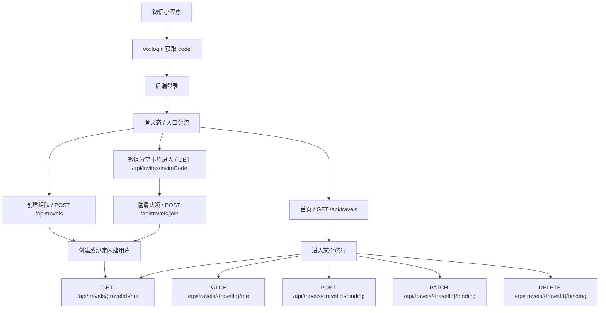
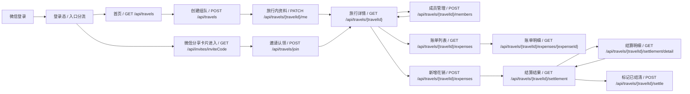

# 后端接口需求文档

## 1. 目标

本文是后端接手当前旅行 AA 记账小程序的实现引导。

- 后端数据库正式选型为 `MySQL`。
- 当前前端代码里的 `travel-store.js` 只用于开发期页面状态和字段参考，正式项目不会保留离线数据。
- 后端要承接全部持久化、鉴权、成员关系、花销、结算、上传和旅行设置。
- 用户体系采用“微信账号 + 旅行内建用户”两层结构，`openid/unionid` 只进绑定表，不作为业务用户主键。
- 同一微信账号可以在不同旅行里对应不同的内建用户，但在同一旅行里只能绑定一个。
- 文档里的字段名以当前前端代码为准，接口输出建议直接使用 `camelCase`，避免前端再做一层字段映射。

### 1.1 身份与绑定流程



### 1.2 业务流转



### 1.3 绑定规则

- 一个微信账号可以在不同旅行里绑定多个内建用户，但在同一旅行里同一时刻只能绑定一个。
- 一个内建用户同一时刻只能绑定一个微信账号。
- 微信登录本身不自动复用其他旅行里的内建用户。
- 微信绑定可换绑，但只在当前旅行内生效，不迁移其他旅行的数据。
- 旅行、成员、账单都归属旅行内建用户，不归属微信账号。
- 昵称和头像以内建用户资料为准，微信侧只用于当前旅行内首次初始化或显式同步。

## 2. 当前前端页面

按业务流转列出，不代表 `pages.json` 的启动页顺序。

| 页面 | 路由 | 当前依赖的字段/动作 | 后端需要承接 |
|---|---|---|---|
| 创建组队 | `pages/create/create` | `title`、`destination`、`ownerName`、`ownerAvatarUrl`、`startDate`、`members`；页面上还有 `advanceAmount`、`catFund`、`permissions` | 创建该旅行内建用户、初始成员、旅行设置 |
| 首页 | `pages/index/index` | `listTravels()`、登录态、`travel.summary`、`memberCount`、`expenseCount` | 按微信绑定关系返回旅行列表、汇总字段 |
| 旅行详情 | `pages/logs/logs` | 详情、成员、账单列表、账单明细、结算、分享卡片、添加成员、标记已结清 | 详情、成员、花销、结清、邀请 |
| 成员管理 | `pages/member-manage/member-manage` | 邀请开关、家庭分组、改昵称、清除认领、禁用记账、移出组队 | 当前旅行用户资料、成员设置、家庭、认领、权限 |
| 新增花销 | `pages/expense/expense` | `title`、`category`、`amount`、`note`、`payerId`、`participantIds` | 记账接口 |
| 结算结果 | `pages/settlement/settlement` | `travel.summary` 的 `balances` 和 `transfers` | 结算接口 |

## 3. 现有后端骨架

当前后端已经有这些接口骨架：

```text
/api/travels/
/api/travels/{id}/
/api/travels/{id}/members/
/api/travels/{id}/expenses/
/api/travels/{id}/settlement/
```

现状要点：

- `GET /api/travels/` 现在返回全部旅行，正式版需要按当前微信账号在各旅行里的有效绑定过滤。
- `POST /api/travels/` 现在还依赖 `owner_openid`，正式版应在这个旅行里创建新的内建用户，而不是复用别的旅行的用户。
- `POST /api/travels/{id}/members/` 现在用 `openid/nickname`，正式版要支持当前旅行内建用户的创建和补全。
- `POST /api/travels/{id}/expenses/` 现在用 `payer_openid/participant_openids`，正式版要改成成员 ID。
- `GET /api/travels/{id}/settlement/` 现在已经有计算能力，正式版只要把返回结构稳定下来。

## 4. 核心数据模型

```ts
interface TravelUser {
  id?: number;
  travelId: string | number;
  nickname: string;
  avatarUrl: string;
  status: 'enabled' | 'disabled';
  createdAt?: string;
  updatedAt?: string;
}

interface WechatBinding {
  id?: number;
  travelId: string | number;
  userId: string | number;
  appid: string;
  openid: string;
  unionid?: string;
  isActive: boolean;
  boundAt?: string;
  unboundAt?: string;
  lastLoginAt?: string;
}

interface TravelMember {
  id: string | number;
  userId: string | number;
  user?: TravelUser;
  name: string;
  avatarUrl?: string;
  isOwner: boolean;
  claimed?: boolean; // 由当前旅行里的微信绑定是否有效推导
  canBookkeep?: boolean;
}

interface ExpenseParticipant {
  memberId: string | number;
  name: string;
  avatarUrl?: string;
}

interface Expense {
  id: string | number;
  title: string;
  category: string;
  amount: string | number;
  payerMemberId: string | number;
  payerUserId?: string | number;
  payerName: string;
  payerAvatarUrl?: string;
  splitType: 'equal' | 'amount';
  participants: ExpenseParticipant[];
  participantShares: Array<{
    memberId: string | number;
    name: string;
    shareAmount: string;
  }>;
  note?: string;
  paidAt: string;
  createdAt: string;
  editable: boolean;
}

interface TravelSummaryBalance {
  memberId: string | number;
  name: string;
  paid: string;
  owed: string;
  net: string;
}

interface TransferSuggestion {
  fromMemberId: string | number;
  fromName: string;
  toMemberId: string | number;
  toName: string;
  amount: string;
}

interface TravelSettings {
  allowInvite: boolean;
  allowMemberFamilyEdit: boolean;
  allowInvitedIdentity: boolean;
  requireAvatar: boolean;
  advanceAmount?: string;
  catFund?: string;
}

interface Travel {
  id: string | number;
  title: string;
  destination?: string;
  currency: string;
  startDate?: string;
  endDate?: string;
  status: '进行中' | '已结清' | 'active' | 'settled';
  inviteCode: string;
  ownerUserId?: string | number;
  createdAt?: string;
  updatedAt?: string;
  members: TravelMember[];
  expenses?: Expense[]; // 可选预览，完整列表走 /expenses
  memberCount?: number;
  expenseCount?: number;
  summary?: {
    totalSpent: string;
    balances: TravelSummaryBalance[];
    transfers: TransferSuggestion[];
  };
  settings?: TravelSettings;
}
```

## 5. 接口契约

### 5.1 登录和旅行内当前用户

#### `POST /api/auth/wechat-login`

用途：把 `wx.login` 的 `code` 换成后端登录态。登录只确认微信身份，不创建、不复用任何旅行内建用户。

Request body:

| 字段 | 类型 | 必填 | 说明 |
|---|---|---|---|
| code | string | 是 | `wx.login` 返回的临时 code。 |
| nickname | string | 否 | 可作为后续创建组队或邀请认领的默认昵称，不直接写入内建用户。 |
| avatarUrl | string | 否 | 可作为后续创建组队或邀请认领的默认头像，不直接写入内建用户。 |

Response:

```json
{
  "code": 0,
  "message": "ok",
  "data": {
    "token": "session-or-jwt-token",
    "wechat": {
      "appid": "wx-appid",
      "unionid": "unionid-from-wechat"
    },
    "hasAnyTravel": true
  }
}
```

没有任何已绑定旅行时：

```json
{
  "code": 0,
  "message": "ok",
  "data": {
    "token": "session-or-jwt-token",
    "wechat": {
      "appid": "wx-appid",
      "unionid": "unionid-from-wechat"
    },
    "hasAnyTravel": false
  }
}
```

#### `GET /api/travels/{travelId}/me`

用途：进入某个旅行后获取当前微信在该旅行里的内建用户和绑定信息。未绑定时只返回绑定状态，不返回业务用户。

#### `PATCH /api/travels/{travelId}/me`

用途：更新当前旅行内建用户的昵称、头像。保存时按整组覆盖，前端传什么就写什么，不区分是否真的修改过。对用户可见的成员资料只展示这两个字段。

Request body:

| 字段 | 类型 | 必填 | 说明 |
|---|---|---|---|
| nickname | string | 否 | 内建用户昵称。 |
| avatarUrl | string | 否 | 内建用户头像。 |

#### `POST /api/travels/{travelId}/binding`

用途：把当前微信绑定到当前旅行里的一个已有内建用户上。

Request body:

| 字段 | 类型 | 必填 | 说明 |
|---|---|---|---|
| userId | string/number | 是 | 当前旅行内要绑定到的内建用户 ID。 |

#### `PATCH /api/travels/{travelId}/binding`

用途：换绑，把当前微信从当前旅行里的旧内建用户切到新的内建用户。换绑只改当前旅行的登录映射，不迁移历史业务数据。

Request body:

| 字段 | 类型 | 必填 | 说明 |
|---|---|---|---|
| userId | string/number | 是 | 当前旅行内的目标内建用户 ID。 |

#### `DELETE /api/travels/{travelId}/binding`

用途：解绑当前微信在当前旅行里的绑定。

### 5.2 旅行

#### `GET /api/travels`

用途：首页旅行列表。按当前微信账号在各旅行中的有效绑定过滤，不依赖某一个全局“当前内建用户”。

建议支持的查询参数：`page`、`pageSize`、`status`。

Response 建议至少包含：

```json
{
  "code": 0,
  "message": "ok",
  "data": {
    "list": [
      {
        "id": 1,
        "title": "杭州周末游",
        "destination": "杭州",
        "currency": "CNY",
        "startDate": "2026-06-18",
        "endDate": "",
        "status": "进行中",
        "inviteCode": "HK1234",
        "createdAt": "2026-06-18T10:00:00Z",
        "updatedAt": "2026-06-18T12:00:00Z",
        "memberCount": 3,
        "expenseCount": 2,
        "summary": {
          "totalSpent": "374.00",
          "balances": [],
          "transfers": []
        }
      }
    ],
    "total": 1,
    "page": 1,
    "pageSize": 20
  }
}
```

#### `POST /api/travels`

用途：创建旅行/组队账本。

Request body 建议：

| 字段 | 类型 | 必填 | 说明 |
|---|---|---|---|
| title | string | 是 | 组队标题。 |
| destination | string | 否 | 地点或备注。 |
| startDate | string | 否 | 活动日期，`YYYY-MM-DD`。 |
| ownerName | string | 否 | 管理员昵称，用于创建这次旅行里的首个内建用户。 |
| ownerAvatarUrl | string | 否 | 管理员头像，用于创建这次旅行里的首个内建用户。 |
| members | array | 否 | 初始同行成员。 |
| advanceAmount | string | 否 | 每只猫猫预收金额。 |
| catFund | string | 否 | 猫猫基金说明或金额。 |
| settings | object | 否 | 旅行级设置。 |

`members` item:

| 字段 | 类型 | 必填 | 说明 |
|---|---|---|---|
| userId | string/number | 否 | 已存在的内建用户。 |
| nickname | string | 否 | 新建内建用户时使用。 |
| avatarUrl | string | 否 | 新建内建用户头像。 |

Response 建议返回完整 `Travel`。

关键约束：

- `ownerUserId` 由后端创建，不要让前端传 `owner_openid`。
- `POST /api/travels` 每次都要创建这次旅行里的新内建用户，并把当前微信绑定到这个新用户上。
- 不要因为当前微信在别的旅行里已有绑定，就复用别的旅行里的内建用户。
- 初始成员创建时，管理员本身必须自动加入 `members`。

#### `GET /api/travels/{travelId}`

用途：详情页、记账页、结算页共用。

Response 建议返回：

- `members`
- `expenses`
- `summary`
- `memberCount`
- `expenseCount`
- `inviteCode`
- `settings`

#### `PATCH /api/travels/{travelId}`

用途：修改标题、地点、日期、状态和设置。

建议支持：

```json
{
  "title": "杭州周末游",
  "destination": "杭州",
  "startDate": "2026-06-18",
  "endDate": "2026-06-20",
  "status": "settled",
  "settings": {
    "allowInvite": true,
    "allowMemberFamilyEdit": true,
    "allowInvitedIdentity": true,
    "requireAvatar": false
  }
}
```

#### `POST /api/travels/{travelId}/settle`

用途：把旅行标记为已结清。

建议 body：

```json
{ "endDate": "2026-06-18" }
```

#### `DELETE /api/travels/{travelId}` / `PATCH /api/travels/{travelId}/archive`

用途：首页删除或归档。

这两个可以先放到 P2，但文档里要先保留位置，因为首页已有按钮语义。

### 5.3 成员

#### `GET /api/invites/{inviteCode}`

用途：微信分享卡片进入后的初始化接口。返回旅行信息和当前可认领的未绑定成员；如果没有可认领成员，前端走创建新成员流程。

Response 建议：

```json
{
  "code": 0,
  "message": "ok",
  "data": {
    "travel": {
      "id": 1,
      "title": "杭州周末游",
      "inviteCode": "HK1234",
      "status": "进行中"
    },
    "claimableMembers": [
      {
        "memberId": 12,
        "name": "小路",
        "avatarUrl": "",
        "isOwner": false
      }
    ]
  }
}
```

关键约束：

- 如果 `claimableMembers` 为空，前端展示头像和昵称输入。
- 这个接口只负责“看见能认领谁”，真正绑定还是走 `POST /api/travels/join`。

#### `POST /api/travels/{travelId}/members`

用途：详情页添加成员。这里可以创建新的内建用户，也可以补全已有用户的资料；管理员也可以在这里创建待认领成员。

Request body：

| 字段 | 类型 | 必填 | 说明 |
|---|---|---|---|
| userId | string/number | 否 | 选已有内建用户。 |
| nickname | string | 否 | 新建内建用户时使用。 |
| avatarUrl | string | 否 | 新建内建用户头像。 |

关键约束：

- 允许创建没有微信绑定的内建用户。
- 成员唯一性建议按 `userId + travelId` 先做基础校验。
- 这里创建或补全的是内建用户，不是微信账号。

#### `PATCH /api/travels/{travelId}/members/{memberId}`

用途：切换记账权限、补充旅行内状态等。当前登录者自己的昵称和头像只走 `PATCH /api/travels/{travelId}/me`，并按头像+昵称整组覆盖。

#### `POST /api/travels/{travelId}/members/{memberId}/clear-claim`

用途：把成员回退成待认领状态。

#### `DELETE /api/travels/{travelId}/members/{memberId}`

用途：移出组队。

#### `POST /api/travels/join`

用途：通过微信分享卡片进入旅行，并把当前微信绑定到一个尚未绑定的成员上；如果没有可认领成员，则按前端填写的昵称和头像创建新成员并绑定。

Request body：

| 字段 | 类型 | 必填 | 说明 |
|---|---|---|---|
| inviteCode | string | 是 | 分享卡片携带的旅行标识。 |
| claimMemberId | string/number | 否 | 认领已有未绑定成员时使用。 |
| nickname | string | 否 | 没有可认领成员时，新建成员的昵称。 |
| avatarUrl | string | 否 | 头像。 |

关键约束：

- 这个接口的核心动作是“认领成员并绑定当前微信”，不是再创建一个微信账号。
- 如果这次旅行里没有未绑定成员，则按 `nickname/avatarUrl` 创建新成员后再绑定。

#### `GET/POST /api/travels/{travelId}/families`
#### `PATCH /api/travels/{travelId}/families/{familyId}`

用途：猫猫家庭。当前前端页面已经有这个方向，但正式版不要放在本地 state 里。

### 5.4 花销

#### `GET /api/travels/{travelId}/expenses`

用途：获取当前旅行的全部账单。账单列表页、详情页都可以直接用这个接口。

建议支持的查询参数：`page`、`pageSize`、`splitType`、`payerMemberId`。

Response 建议：

```json
{
  "code": 0,
  "message": "ok",
  "data": {
    "list": [
      {
        "expenseId": 11,
        "title": "晚餐",
        "amount": "90.00",
        "payerMemberId": 1,
        "payerUserId": 9,
        "payerName": "你",
        "splitType": "amount",
        "participants": [
          { "memberId": 1, "name": "你" },
          { "memberId": 2, "name": "小路" }
        ],
        "participantShares": [
          { "memberId": 1, "name": "你", "shareAmount": "30.00" },
          { "memberId": 2, "name": "小路", "shareAmount": "60.00" }
        ],
        "createdAt": "2026-06-18T12:00:00Z",
        "editable": true
      }
    ],
    "total": 1,
    "page": 1,
    "pageSize": 20
  }
}
```

关键约束：

- `splitType` 建议取值为 `equal` / `amount`。
- `participants` 表示参与分摊的用户。
- `participantShares` 建议无论平摊还是按金额分都返回，前端直接展示最省事。
- `editable` 由后端根据当前微信在这次旅行里的权限、旅行状态、账单状态判定。

#### `GET /api/travels/{travelId}/expenses/{expenseId}`

用途：账单明细。字段与列表项保持同一套结构，必要时可以额外带 `note`、`paidAt`、分摊说明。

#### `POST /api/travels/{travelId}/expenses`

用途：新增花销。

Request body 建议：

| 字段 | 类型 | 必填 | 说明 |
|---|---|---|---|
| title | string | 是 | 例如“晚餐”。 |
| category | string | 否 | 默认“其他”，前端当前默认“餐饮”。 |
| amount | string/number | 是 | 金额，必须大于 0。 |
| note | string | 否 | 备注。 |
| payerMemberId | string/number | 是 | 付款成员 ID。 |
| participantMemberIds | array | 否 | 分摊成员 ID；为空时默认全员。 |
| paidAt | string | 否 | 支付时间。 |

关键约束：

- 这里必须用成员 ID，不要再用 `payer_openid`。
- 临时成员没有 `openid` 也要能记账和分摊。

#### `PATCH /api/travels/{travelId}/expenses/{expenseId}`
#### `DELETE /api/travels/{travelId}/expenses/{expenseId}`

用途：编辑和删除账单。

#### `GET /api/expense-categories`

用途：可选，给花销分类下拉用。当前前端是自由输入，不是 P0。

### 5.5 结算

#### `GET /api/travels/{travelId}/settlement`

用途：结算页展示成员净额和转账建议。

Response 建议：

```json
{
  "code": 0,
  "message": "ok",
  "data": {
    "totalSpent": "374.00",
    "balances": [
      {
        "memberId": 1,
        "name": "你",
        "paid": "246.00",
        "owed": "124.67",
        "net": "121.33"
      }
    ],
    "transfers": [
      {
        "fromMemberId": 2,
        "fromName": "小路",
        "toMemberId": 1,
        "toName": "你",
        "amount": "121.33"
      }
    ]
  }
}
```

后端可以继续把计算结果写进 `Settlement.payload`，但前端只需要稳定读取这个结构。

#### `GET /api/travels/{travelId}/settlement/detail`

用途：结算明细页 / 核对页。返回每个成员的垫付、应摊、净额，以及该成员对应的分摊来源账单。

建议复用 `GET /api/travels/{travelId}/settlement` 的计算结果，再展开明细。

Response 建议：

```json
{
  "code": 0,
  "message": "ok",
  "data": {
    "totalSpent": "374.00",
    "balances": [
      {
        "memberId": 1,
        "name": "你",
        "paid": "246.00",
        "owed": "124.67",
        "net": "121.33",
        "netType": "receivable",
        "sourceExpenses": [
          {
            "expenseId": 11,
            "title": "晚餐",
            "category": "餐饮",
            "amount": "90.00",
            "shareAmount": "30.00",
            "payerMemberId": 1,
            "payerName": "你",
            "paidAt": "2026-06-18T12:00:00Z"
          }
        ]
      }
    ],
    "transfers": [
      {
        "fromMemberId": 2,
        "fromName": "小路",
        "toMemberId": 1,
        "toName": "你",
        "amount": "121.33"
      }
    ]
  }
}
```

关键约束：

- `paid` 表示实际垫付，`owed` 表示应分摊，`net` 为 `paid - owed`。
- `netType` 建议取值为 `receivable` / `payable` / `settled`，方便前端直接展示“应收 / 应付 / 已平账”。
- `sourceExpenses` 只列出影响该成员分摊结果的账单来源。

### 5.6 头像上传

#### `POST /api/uploads/avatar`

用途：保存 `chooseAvatar` 的头像。

请求格式：`multipart/form-data`

## 6. 统一约定

### 6.1 命名

- 对外接口建议直接用 `camelCase`。
- 后端模型内部可以继续用 `snake_case`。
- 前端不再承担本地离线数据兜底，所以字段名越统一越省事。

### 6.2 响应格式

建议全站统一为：

```json
{ "code": 0, "message": "ok", "data": {} }
```

如果项目决定继续沿用 DRF 原始响应，那就必须全站一致，不能混用。

### 6.3 鉴权

- 正式项目不要让前端伪造 `openid`。
- `ownerUserId`、记账权限、成员归属都应该由后端登录态判定。
- 进入具体旅行后的接口应该围绕当前旅行里的绑定内建用户工作。
- 首页列表按当前微信账号的旅行绑定关系过滤；创建组队会新建当前旅行的内建用户和绑定。
- 未登录、过期、无权限要明确返回错误码。

### 6.4 错误码

| code/status | 场景 |
|---|---|
| 0 / 200 | 成功 |
| 400 | 参数错误 |
| 401 | 未登录或登录失效 |
| 403 | 无权限 |
| 404 | 资源不存在 |
| 409 | 重复成员、重复加入、状态冲突 |
| 500 | 服务端异常 |

## 7. 优先级

### P0

1. `POST /api/auth/wechat-login`
2. `GET /api/travels`
3. `POST /api/travels`
4. `GET /api/travels/{travelId}/me`
5. `PATCH /api/travels/{travelId}/me`
6. `POST /api/travels/{travelId}/binding`
7. `PATCH /api/travels/{travelId}/binding`
8. `DELETE /api/travels/{travelId}/binding`
9. `GET /api/travels/{travelId}`
10. `POST /api/travels/{travelId}/members`
11. `POST /api/travels/{travelId}/expenses`
12. `GET /api/travels/{travelId}/settlement`
13. `GET /api/travels/{travelId}/settlement/detail`
14. `POST /api/travels/{travelId}/settle`

### P1

1. `POST /api/travels/join`
2. `GET /api/invites/{inviteCode}`
3. `PATCH /api/travels/{travelId}`
4. `PATCH /api/travels/{travelId}/expenses/{expenseId}`
5. `DELETE /api/travels/{travelId}/expenses/{expenseId}`
6. `POST /api/uploads/avatar`
7. 成员改名、清除认领、删除成员
8. 旅行 settings 落库

### P2

1. 归档 / 删除旅行
2. 分类字典
3. 猫猫家庭
4. 预收款 / 猫猫基金独立台账
5. 成员记账权限控制

## 8. 后端需要补齐的点

1. 用户表和微信绑定表分离，`openid/unionid` 不进业务用户表。
2. 微信登录只识别绑定关系，不直接创建业务用户。
3. 创建组队和邀请认领负责把微信身份 materialize 到内建用户上。
4. 支持当前微信绑定到某个内建用户，并支持换绑、解绑。
5. 列表接口按当前微信账号在各旅行里的有效绑定过滤。
6. 创建旅行时新建该旅行内建 owner，并绑定当前微信，不再依赖 `owner_openid`。
7. 成员、花销、结算都改成以成员 ID / 内建用户 ID 为中心。
8. 结算 summary/detail 接口返回结构稳定为 camelCase。
9. 邀请、家庭、权限等设置不要继续留在前端本地 state。
10. 不要再把离线数据当成上线方案。

## 9. 待确认

1. 登录态用 JWT、session 还是 DRF token。
2. 分享卡片是否还需要额外参数（当前默认只保留 `inviteCode`）。
3. `advanceAmount`、`catFund` 是否第一期就入库。
4. 家庭和成员记账权限是否第一期必须上线。
5. 成员改名和清除认领的最终接口路径。
